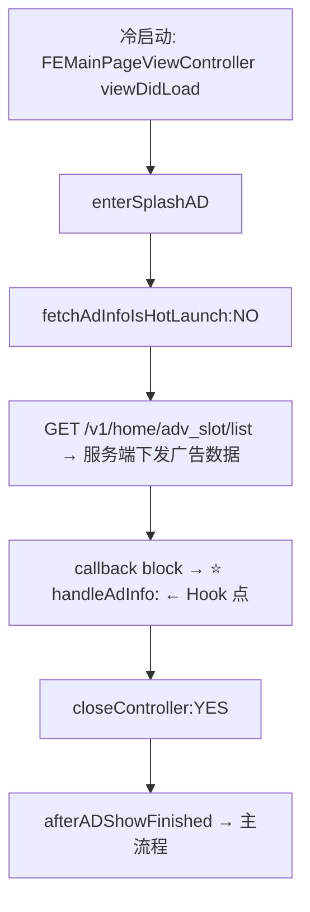
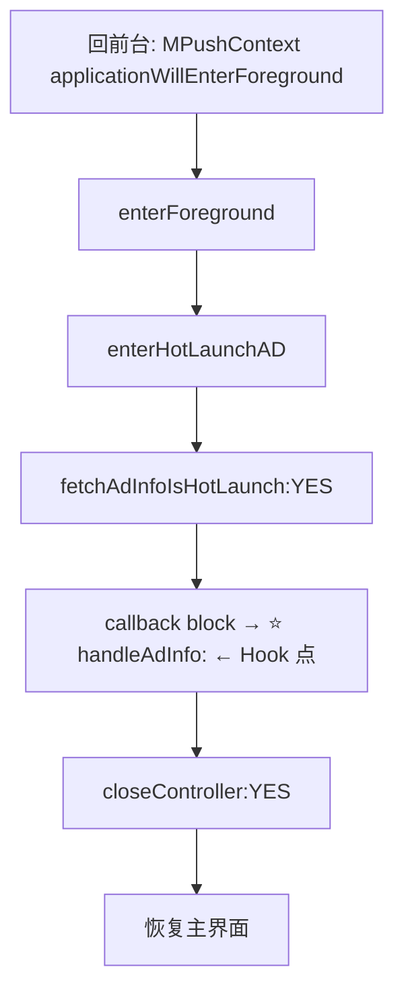
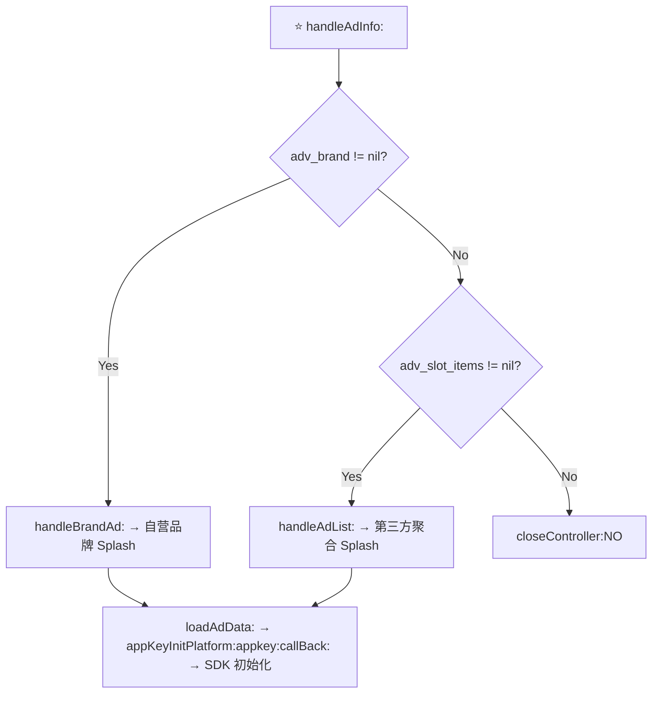

<div align="center">

# 🚫 NoBrandSplash

**5EPlay 去开屏广告插件（v2.0）· TrollFools dylib**

Block 5EPlay's splash ads (brand + third-party aggregators) via a single Objective-C runtime hook.

[](https://github.com/antisali996-dot/5eplay-noads/releases)
[](LICENSE)
[](https://github.com/antisali996-dot/5eplay-noads/actions)
[]()

*用于学习 iOS 逆向与 TrollFools 注入技术研究。请仅用于你自己拥有或已获授权的设备。*

</div>

---

## 📋 目录

- [功能特性](#-功能特性)
- [逆向分析](#-逆向分析)
- [Hook 设计](#-hook-设计)
- [构建](#-构建)
- [安装与验证](#-安装与验证)
- [排错指南](#-排错指南)
- [开发踩坑记录](#-开发踩坑记录)
- [Roadmap](#-roadmap)
- [FAQ](#-faq)
- [License](#-license)

---

## ✨ 功能特性

- 🎯 **单点阻断**：Hook `-[SADSplashAdViewController handleAdInfo:]` —— 冷启动/热启动开屏广告数据共同入口
- 🛡 **双覆盖**：同时覆盖品牌 Splash（`handleBrandAd:`）与第三方聚合 Splash（`handleAdList:`：CSJ / GDT / OCT / BeiZi / CJMobile / Sigmob）
- 🔒 **不破坏启动流程**：阻断后自动调用 `closeController:YES`，保证 App 正常进入主界面
- 🚫 **不初始化广告 SDK**：`loadAdData:`（SDK 初始化/加载路径）只能从广告分支进入，在 `handleAdInfo:` 阻断后不会到达
- 🧪 **可观测**：`hook OK` / `hook MISS` / `BLOCKED` 三级日志 + 注入成功弹窗
- 📦 **纯源码可审计**：Hook 逻辑只在一个 `.m` 文件里，结构自检脚本验证产物
- 🛠 **clang + ld64.lld 构建**：产物带 `LC_DYLD_CHAINED_FIXUPS`，TrollFools 可注入

**目标环境**

| 项 | 值 |
|---|---|
| 目标 App | 5EPlay 对战平台（CS:GO / CS2 社区） |
| App 版本 | 7.2.1 |
| Bundle ID | `com.5e.5eplay` |
| 产物架构 | arm64（thin） |
| iOS | 14 – 17（TrollStore / TrollFools） |

---

## 🔬 逆向分析

> 基于解密版 5EPlay 7.2.1（IDA 反编译）确认的完整广告触发链路。

### 冷启动开屏广告触发链路



### 热启动开屏广告触发链路



### handleAdInfo: 为什么是总入口



- `handleAdInfo:` 的 objc_msgSend stub **唯二调用者**是冷启动与热启动的 fetchAdInfo 回调 block → 冷/热启动广告数据在此汇合
- 拦截 `handleAdInfo:` 同时覆盖 `adv_brand` 与 `adv_slot_items` 两条分支：
  - 自营品牌 Splash（SADBrandSplashAd）
  - 第三方聚合 Splash：CSJ（穿山甲）/ GDT（广点通）/ OCT / BeiZi（倍孜）/ CJMobile / Sigmob
- `loadAdData:` 是广告 SDK 初始化/加载路径（`appKeyInitPlatform:appkey:callBack:` 的唯一调用者），它**只能从后续广告分支进入** → 在 `handleAdInfo:` 阻断后不会进入 Splash 广告 SDK 加载阶段

### 关键函数（已确认存在）

| 方法 | 分析地址 | ObjC 类型签名 |
|---|---|---|
| `-[SADSplashAdViewController handleAdInfo:]` | `0x1022F7474` | `v24@0:8@16` |
| `-[SADSplashAdViewController closeController:]` | `0x1022F759C` | `v20@0:8B16` |
| `-[SADSplashAdViewController handleBrandAd:]` | `0x1022F7998` | `v24@0:8@16` |
| `-[SADSplashAdViewController handleAdList:]` | `0x1022F7A98` | `v24@0:8@16` |

> ⚠️ 地址仅供分析定位使用，插件本身通过 **Class + Selector** 定位，不依赖地址。

### 为什么选这个 Hook 点

- `handleAdInfo:` 是冷启动 + 热启动进入 Splash 数据处理后的**共同入口**（XREF 唯二调用者 = 两个 fetchAdInfo 回调 block）
- 品牌 + 第三方聚合**双覆盖**，不需要分别 Hook 两套启动路径
- 它位于**业务层**，而非 GDT/CSJ 等 SDK 层 —— SDK 更新不失效、覆盖面完整
- 上游由服务端 `adv_display` 开关控制，Hook 它等价于同时覆盖「服务端开关」与「内容分支」

---

## 🪝 Hook 设计

```objc
// 替换 -[SADSplashAdViewController handleAdInfo:]
static void hook_handleAdInfo(id self, SEL _cmd, id adInfo) {
    LOG("BLOCKED: handleAdInfo:");            // ① 执行日志
    [self closeController:YES];                // ② 生命周期收尾
}
```

**为什么不能只 `return`？**

`handleAdInfo:` 被调用时，`SADSplashAdViewController` 的视图**已经挂在启动窗口上**（冷启动由 `enterSplashAD` 创建挂载；热启动由热启动回调 block 创建挂载）。若直接置空，原流程里的 `checkTimeout`（超时自动关闭）和 `closeController:` 都不会被触发 → **启动页永久卡死**。

因此阻断后必须显式调用 `closeController:YES`：
- 触发 `closeHandle` block → `afterADShowFinished` → 发 `Notif_AfterADShowFinished` → App 继续初始化 ✅
- `YES` = 正常关闭，不写入 `saveFailSplashADDate`（仅 `NO` 分支写入），**不污染服务端频控数据** ✅

**Hook 时机**：`constructor` 只做 `dlsym` 符号解析 + 注册 `UIApplicationDidFinishLaunchingNotification`；真正的 `method_setImplementation` 推迟到启动完成回调 —— 避免早期调用 ObjC runtime API 触发 SIGILL。

### v2.0 从 `handleBrandAd:` 迁移到 `handleAdInfo:`

v1.0 Hook `handleBrandAd:` 只覆盖**品牌 Splash 单分支**；当服务端下发 `adv_slot_items`（广告位列表）而 `adv_brand` 为空时，第三方聚合 Splash 会绕过旧 Hook 照常展示。

v2.0 迁移到共同分叉点 `handleAdInfo:`：

| 对比项 | v1.0（handleBrandAd:） | v2.0（handleAdInfo:） |
|---|---|---|
| 品牌 Splash | ✅ | ✅ |
| 第三方聚合 Splash（CSJ/GDT/OCT/BeiZi/CJMobile/Sigmob） | ❌ 漏 | ✅ |
| 冷启动 | ✅ | ✅ |
| 热启动 | ✅ | ✅ |
| SDK 初始化/加载 | 品牌分支不初始化 | **完全不初始化** |
| 频控污染 | 无（closeController:YES） | 无（closeController:YES） |
| 需要分别 Hook 两套路径 | — | 不需要，单点 |

---

## 🛠 构建

### 前置依赖

| 依赖 | 版本 | 获取方式 |
|---|---|---|
| clang | ≥ 16 | LLVM 官方 Windows 发行版 |
| ld64.lld | 与 clang 配套 | 同上 |
| iPhoneOS SDK | iOS 16.5+ | Theos / Xcode |

### Windows

```
build.cmd
```

产物：`out/NoBrandSplash.dylib`（arm64 thin）

### macOS / Linux

```bash
clang -target arm64-apple-ios16.5 \
  -arch arm64 \
  -isysroot "$(xcrun --sdk iphoneos --show-sdk-path)" \
  -fobjc-arc -fno-stack-protector -fvisibility=hidden \
  -fuse-ld=lld -dynamiclib -undefined dynamic_lookup \
  -o out/NoBrandSplash.dylib src/hook.m
```

> 💡 任何工具链构建后，**必须**运行 `python tools/check_macho.py out/NoBrandSplash.dylib` 验证结构，否则 dyld 可能静默拒绝加载。

### CI 自动构建

本仓库配置了 [GitHub Actions](../../actions)，每次推送/打 tag 都会在 macOS runner 上自动构建并校验产物，可下载 workflow artifact 或直接使用 [Release](../../releases) 中的 dylib。

---

## 📲 安装与验证

### 安装

1. 从 [Releases](../../releases) 下载 `NoBrandSplash.dylib`，传到 iPhone（AirDrop / 网盘均可）
2. 用 **TrollFools** 打开 dylib：
   - iOS 14–15：TrollFools 选择 dylib → 选择 5EPlay 注入
   - iOS 16+：TrollFools 的「导入应用」→ 选择已安装的 5EPlay → 注入
3. **杀掉 5EPlay 进程后冷启动**（注入不重启不生效）

### 验证注入生效（3 个信号）

| 信号 | 说明 |
|---|---|
| ① 弹窗 | 启动约 1–2 秒弹出 `NoBrandSplash Injected OK`，2 秒自动消失 |
| ② 无开屏广告 | 冷启动 / 热启动（回前台）均不出现品牌或第三方聚合 Splash |
| ③ 启动不卡 | 能正常进入主界面，回前台正常恢复 |

### 确认日志（可选）

设备端 `log stream` 过滤 `NoBrandSplash`：

```
[NoBrandSplash] plugin loaded, resolving symbols...
[NoBrandSplash] constructor done, waiting for app launch
[NoBrandSplash] app did finish launching, begin hooking
[NoBrandSplash] hook OK: -[SADSplashAdViewController handleAdInfo:]
[NoBrandSplash] BLOCKED: -[SADSplashAdViewController handleAdInfo:]
```

- `hook OK` = Hook 方法命中
- `BLOCKED` = 开屏广告（品牌 + 第三方）被成功拦截
- 冷启动 / 热启动各应出现一次 `BLOCKED`

---

## 🔧 排错指南

| 现象 | 原因 | 处理 |
|---|---|---|
| 无弹窗、无日志 | dylib 未加载（weak 加载静默失败） | 确认已注入 TrollFools；确认 5EPlay 是 TrollStore 安装（非 App Store 版） |
| 弹窗出现但仍有广告 | Hook MISS（版本差异） | 检查日志 `hook MISS` → 重新逆向确认方法名 |
| 启动页卡死 | `closeController:` 未生效 | 确认日志有 `BLOCKED`；若仍卡，逆向确认 closeHandle 链路 |
| 注入后崩溃 | 版本不匹配 / 工具链问题 | 查 `.ips`；确认 dylib 有 `CHAINED_FIXUPS` |

---

## 🐞 开发踩坑记录

1. **工具链必须 clang + ld64.lld**：zig 产物缺 `LC_DYLD_CHAINED_FIXUPS` + `__init_offsets`，dyld 静默拒绝（weak 加载失败无提示）。
2. **lld 20 用 `__init_offsets` 替代 `__mod_init_func`**：check 脚本报 `no __mod_init_func` WARN 属正常，不影响注入。
3. **PowerShell 调 clang 时 `-o` 被误解析**：改用 `cmd /c build.cmd`。
4. **constructor 禁止调 objc runtime API**：早期调 `class_getInstanceMethod` 会 SIGILL，必须等启动完成通知。
5. **阻断后必须调 `closeController:`**：否则 splash 视图常驻、启动卡死；传 `YES` 避免污染频控。
6. **`@"..."` 字面量需要 `.m` 编译**：`.c` 编译会报 `@` 语法错误。

---

## 🗺 Roadmap

- [x] MVP（v1.0）：阻断品牌开屏广告（`handleBrandAd:`）
- [x] v2.0：迁移到 `handleAdInfo:`，覆盖品牌 + 第三方聚合 Splash（冷/热启动双覆盖）
- [ ] SDK 出口兜底（各平台 `SplashAd.showAd`）
- [ ] 插屏 / 激励视频去广告（可配置开关）

---

## ❓ FAQ

**Q: 为什么不去 Hook 穿山甲 / 优量汇 SDK？**
A: 业务层共同入口 `handleAdInfo:` 在 SDK 层之前阻断，品牌与第三方聚合全部覆盖；Hook SDK 层在版本更新后极易失效，且需要逐个平台 Hook。

**Q: 会不会被服务端反制？**
A: 插件主动关闭广告时传 `YES`，不会写入"展示失败"频控数据，避免影响服务端对账号的判断。

**Q: App 升级后失效怎么办？**
A: 先看日志是 `hook MISS` 还是 `target class NOT FOUND`，再决定重新逆向方法名或整条链路。

---

## 📄 License

[MIT](LICENSE)

---

*仅供学习 iOS 逆向与 TrollFools 注入技术研究使用。请仅在你自己拥有、或已获授权修改的设备/应用上使用。使用本插件造成的任何后果由使用者自行承担。*
